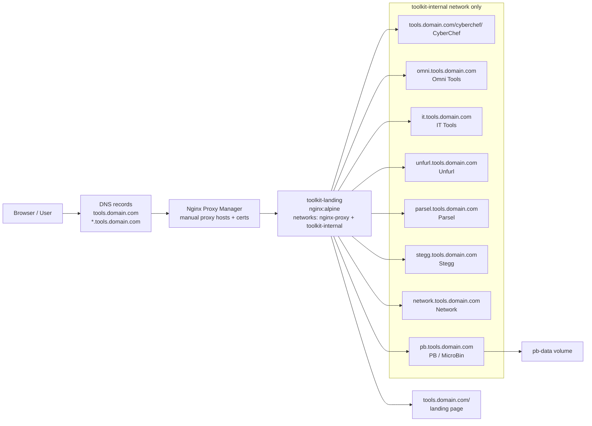

# Conversion Toolkit

Self-hosted toolkit stack with one nginx landing/proxy container and a mix of
subpath and subdomain tools:

- [Omni Tools](https://github.com/iib0011/omni-tools)
- [CyberChef](https://github.com/gchq/cyberchef)
- [IT Tools](https://github.com/CorentinTh/it-tools)
- [Unfurl](https://github.com/RyanDFIR/unfurl)
- [Parsel](https://github.com/elder-plinius/P4RS3LT0NGV3)
- [Stegg](https://github.com/elder-plinius/ST3GG)
- [Network](https://github.com/Lissy93/networking-toolbox)
- [PB / MicroBin](https://github.com/szabodanika/microbin)

Production routing is driven by `ROOT_DOMAIN` in `.env` (for example
`domain.com`). [Nginx Proxy Manager (NPM)](https://github.com/NginxProxyManager/nginx-proxy-manager)
forwards `tools.domain.com` to `toolkit-landing:80`, and `toolkit-landing`
fans out to the tool subdomains. Certificate handling stays manual and out of
scope.

## Repository Structure

```text
.
├── docker-compose.yml
├── docker-compose.local.yml
├── .env.example
├── landing/
│   ├── index.html
│   └── nginx.conf.template
├── parsel/
│   └── Dockerfile
├── stegg/
│   └── Dockerfile
├── tests/
│   ├── verify-toolkit.ps1
│   └── verify-toolkit.sh
├── unfurl/
│   └── unfurl.ini
└── README.md
```

## Production Notes

This is the primary deployment mode for the repository.

1. Copy `.env.example` to `.env`.

   ```powershell
   Copy-Item .env.example .env
   ```

   ```bash
   cp .env.example .env
   ```

2. Edit `.env` for your production domain and PB / MicroBin settings.

   At minimum, review:

   - `ROOT_DOMAIN=domain.com`
   - `MICROBIN_ADMIN_USERNAME`
   - `MICROBIN_ADMIN_PASSWORD`
   - `MICROBIN_PUBLIC_PATH`
   - the PB privacy toggles in `.env.example`

3. Start the production stack with the base Compose file.

   ```bash
   docker compose up -d
   ```

   The first run builds all three repo-local images:

   - `parsel/Dockerfile`
   - `stegg/Dockerfile`
   - `unfurl/Dockerfile`

   `Parsel` and `Stegg` clone pinned upstream refs during image build, and
   `Unfurl` clones the pinned `RyanDFIR/unfurl` commit during image build.
   `Network` and `PB / MicroBin` are pulled from published images instead.

4. Rebuild the repo-local images whenever you change one of those Dockerfiles or
   want to refresh the pinned upstream sources.

   ```bash
   docker compose build parsel stegg unfurl
   ```

   The current Parsel image build uses:
   - `git clone https://github.com/elder-plinius/P4RS3LT0NGV3.git .`
   - pinned commit `730ce238a81357edcb07bfff91d0159de2556180`

   The current Stegg image build uses:
   - `git clone https://github.com/elder-plinius/ST3GG.git .`
   - pinned commit `7db09389507f90025e728a9516e155ebcf8dbeaf`

   The current Unfurl image build still uses:
   - `git clone https://github.com/RyanDFIR/unfurl /unfurl`
   - pinned commit `2d2dac375433d2a7fbeede2d25c5f19b68d4d244`

5. Create the Nginx Proxy Manager proxy hosts manually. Every public hostname
   should forward to `toolkit-landing:80`, with your certificates attached in
   NPM.

| Public host | Path | Target app |
| --- | --- | --- |
| `tools.domain.com` | `/` | Landing page |
| `tools.domain.com` | `/cyberchef/` | CyberChef |
| `omni.tools.domain.com` | `/` | Omni Tools |
| `it.tools.domain.com` | `/` | IT Tools |
| `unfurl.tools.domain.com` | `/` | Unfurl |
| `parsel.tools.domain.com` | `/` | Parsel |
| `stegg.tools.domain.com` | `/` | Stegg |
| `network.tools.domain.com` | `/` | Network |
| `pb.tools.domain.com` | `/` | PB / MicroBin |

### Production network flow



- Recommended NPM settings for each proxy host:
  - Forward hostname: `toolkit-landing`
  - Forward port: `80`
  - Enable Websockets Support
  - Use the existing certificate for the host

- Keep the base `docker-compose.yml` for production so `nginx-proxy` stays an
  external network there.
- `toolkit-landing` remains the only container attached to both `nginx-proxy`
  and `toolkit-internal`; the tool containers stay internal-only.
- Certificate creation and renewal are handled manually outside the repo.

## Local Development

Use the local override only when you want a quick standalone test environment on
port `8080`.

1. Copy `.env.example` to `.env`.

   ```powershell
   Copy-Item .env.example .env
   ```

   ```bash
   cp .env.example .env
   ```

2. Start the local stack with the override file:

   ```bash
   docker compose -f docker-compose.yml -f docker-compose.local.yml up -d
   ```

3. If you need to rebuild the repo-local images locally:

   ```bash
   docker compose -f docker-compose.yml -f docker-compose.local.yml build parsel stegg unfurl
   ```

4. Open the stack locally with localtest.me hosts:

   - `http://tools.localtest.me:8080/`
   - `http://tools.localtest.me:8080/cyberchef/`
   - `http://omni.tools.localtest.me:8080/`
   - `http://it.tools.localtest.me:8080/`
   - `http://unfurl.tools.localtest.me:8080/`
   - `http://parsel.tools.localtest.me:8080/`
   - `http://stegg.tools.localtest.me:8080/`
   - `http://network.tools.localtest.me:8080/`
   - `http://pb.tools.localtest.me:8080/`

`localtest.me` resolves to `127.0.0.1`, so basic testing works without editing
your hosts file.

The local override publishes only `toolkit-landing` on port `8080`. The tool
containers remain unexposed.

### Local routing map

| URL | App |
| --- | --- |
| `http://tools.localtest.me:8080/` | Landing page |
| `http://tools.localtest.me:8080/cyberchef/` | CyberChef |
| `http://omni.tools.localtest.me:8080/` | Omni Tools |
| `http://it.tools.localtest.me:8080/` | IT Tools |
| `http://unfurl.tools.localtest.me:8080/` | Unfurl |
| `http://parsel.tools.localtest.me:8080/` | Parsel |
| `http://stegg.tools.localtest.me:8080/` | Stegg |
| `http://network.tools.localtest.me:8080/` | Network |
| `http://pb.tools.localtest.me:8080/` | PB / MicroBin |

### Why some tools use subdomains

Omni Tools and IT Tools are better served from their own subdomains because
their SPA routing and asset loading are not reliable under shared subpaths.

Unfurl also runs on its own subdomain. Its upstream Flask app expects
root-level routes such as `/`, `/graph`, `/json/visjs`, and `/static/*`, so
proxying it under `/unfurl/` would require patching upstream behavior. The
landing page keeps a relative `/unfurl/` link, and `toolkit-landing` redirects
that path to the Unfurl subdomain. The repository does not vendor the upstream
source; the local `unfurl/Dockerfile` clones the pinned commit during image
build instead.

Parsel and Stegg are built from repo-local Dockerfiles and are served from
their own subdomains for the same routing isolation.

Network uses the published `lissy93/networking-toolbox` image and is treated
as a subdomain-only app.

PB / MicroBin is also subdomain-only in practice. It needs a persistent volume,
admin credential env vars, a configured public path that matches the subdomain,
and a larger upload allowance than the defaults, so it is best handled as a
dedicated host.

### New package setup notes

- **Parsel** builds from the repo-local `parsel/Dockerfile`, which clones a pinned
  upstream commit during image build and serves the built static app from nginx.
- **Stegg** builds from the repo-local `stegg/Dockerfile`, which clones a pinned
  upstream commit and serves the static app from nginx.
- **Network** uses the published `lissy93/networking-toolbox:latest` image and
  stays on `network.tools.<domain>` because the published build expects to run at
  `/`.
- **PB / MicroBin** uses `danielszabo99/microbin:latest` with a named `pb-data`
  volume. Set `MICROBIN_ADMIN_USERNAME`, `MICROBIN_ADMIN_PASSWORD`, and
  `MICROBIN_PUBLIC_PATH` in `.env`, and review the privacy toggles in
  `.env.example` before exposing it.

## Verification

Run the lightweight repository checks:

```powershell
.\tests\verify-toolkit.ps1 scaffold
.\tests\verify-toolkit.ps1 compose
.\tests\verify-toolkit.ps1 proxy
.\tests\verify-toolkit.ps1 landing
.\tests\verify-toolkit.ps1 docs
.\tests\verify-toolkit.ps1 runtime
```

```bash
bash ./tests/verify-toolkit.sh scaffold
bash ./tests/verify-toolkit.sh compose
bash ./tests/verify-toolkit.sh proxy
bash ./tests/verify-toolkit.sh landing
bash ./tests/verify-toolkit.sh docs
bash ./tests/verify-toolkit.sh runtime
```

Useful runtime checks:

```powershell
docker compose config
docker compose -f docker-compose.yml -f docker-compose.local.yml build parsel stegg unfurl
docker compose -f docker-compose.yml -f docker-compose.local.yml build unfurl
docker compose -f docker-compose.yml -f docker-compose.local.yml ps
docker ps
docker network inspect nginx-proxy
```

Suggested runtime checks:

```powershell
Invoke-WebRequest http://tools.localtest.me:8080/
Invoke-WebRequest http://tools.localtest.me:8080/cyberchef/
Invoke-WebRequest http://omni.tools.localtest.me:8080/
Invoke-WebRequest http://it.tools.localtest.me:8080/
Invoke-WebRequest http://unfurl.tools.localtest.me:8080/
Invoke-WebRequest http://parsel.tools.localtest.me:8080/
Invoke-WebRequest http://stegg.tools.localtest.me:8080/
Invoke-WebRequest http://network.tools.localtest.me:8080/
Invoke-WebRequest http://pb.tools.localtest.me:8080/
```

```bash
docker compose -f docker-compose.yml -f docker-compose.local.yml build parsel stegg unfurl
docker compose -f docker-compose.yml -f docker-compose.local.yml build unfurl
curl -I http://tools.localtest.me:8080/
curl -I http://tools.localtest.me:8080/cyberchef/
curl -I http://omni.tools.localtest.me:8080/
curl -I http://it.tools.localtest.me:8080/
curl -I http://unfurl.tools.localtest.me:8080/
curl -I http://parsel.tools.localtest.me:8080/
curl -I http://stegg.tools.localtest.me:8080/
curl -I http://network.tools.localtest.me:8080/
curl -I http://pb.tools.localtest.me:8080/
```
